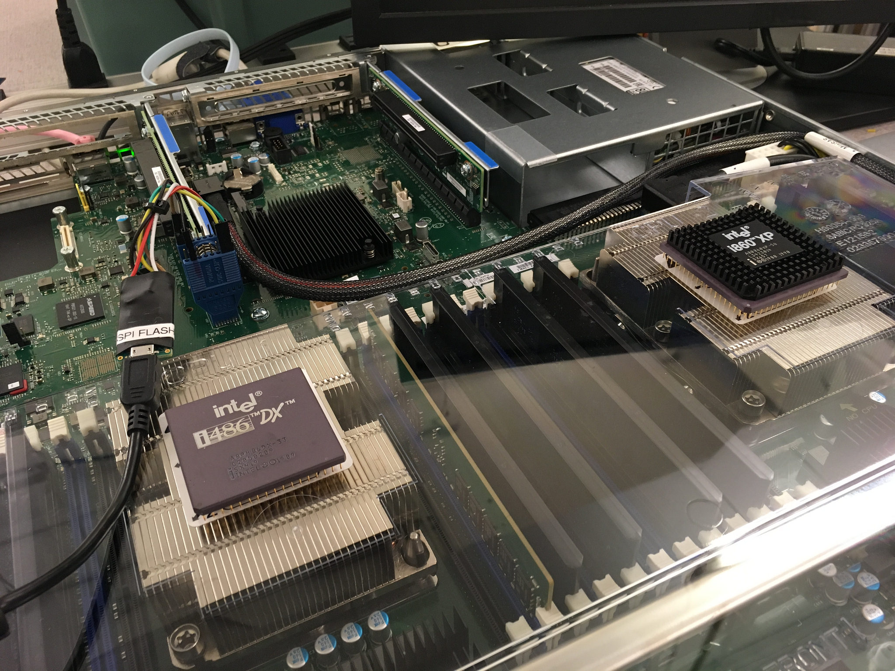

### Additional Reasons for LinuxBoot

Just in case the front page did not convince you...

* You can use any filesystem that Linux supports, not just FAT.
* You can implement boot policies using normal Linux applications, e.g.
  shell scripts or binaries, rather than manipulating opaque NVRAM variables.
* You can run Linux applications straight from the ROM.
* You can avoid legacy partitions entirely and use LVM for flexible volume
  management.
* You can build it yourself and verify that the reproducible build matches what
  others have built to ensure that the firmware is clean.
* You can have the firmware attest to you via TOTP that it hasn't been changed.
* You can have a fully encrypted disk, with secrets sealed in the TPM and only
  unsealed if the firmware is unmodified.
* You can include device drivers for things that UEFI doesn't support.
* You can use external hardware tokens like a Yubikey to sign the OS install
  and have the firmware validate the GPG signature.

### LinuxBoot, NERF, HEADS? What's What?

*   *LinuxBoot* is the project that replaces specific firmware functionality
    with a Linux kernel. LinuxBoot is agnostic to what initramfs is used with
    the kernel.

*   *NERF* is LinuxBoot with [u-root](https://github.com/u-root/u-root) as the
    initramfs. u-root contains boot policy tools in Go (e.g. PXE booting,
    booting via GRUB config) among standard busybox-like utilities rewritten in
    Go.

*   *HEADS* is a secure runtime that can be used as the initramfs for LinuxBoot.
    Take a look at the [repository on
    GitHub](https://github.com/osresearch/heads/). See
    [osresearch.net](http://osresearch.net/) for more documentation on HEADS.

Initially, all three of these projects were called NERF. Because this would have
only become more confusing, and because we do not want to be prescriptive of the
initramfs, we named the Linux kernel in firmware *LinuxBoot*.

### Will Anyone Ever Ship This?

[Horizon Computing](http://www.horizon-computing.com) plans to ship Open
Compute Platform
[Winterfell](http://www.horizon-computing.com/?project=winterfell) nodes with
LinuxBoot/NERF in Q2 2018.

[Facebook](https://engineering.fb.com/data-center-engineering/f16-minipack/) and
[Arista Networks](https://www.arista.com/en/company/news/press-release/6785-pr-20190314)
have implemented LinuxBoot with coreboot in a joint effort for the
[Arista 7368X4 network switch](https://www.arista.com/en/products/arista-7368x4-series-datasheet-quick-look).

The [Equus R1560](https://www.equuscs.com/servers/whitebox-open/r1560/)
server board
[supports LinuxBoot](https://www.equuscs.com/introducing-the-whitebox-open-r1560-servers/). 

### Do I Need A coreboot-compatible Motherboard?

No, LinuxBoot is compatible with UEFI as well as coreboot. You can use
LinuxBoot as a UEFI DXE or as a [coreboot
payload](https://review.coreboot.org/#/c/coreboot/+/23071/). See Ron Minnich's
talk "Replace your exploit-ridden firmware with a Linux kernel":
[video](https://www.youtube.com/watch?v=iffTJ1vPCSo) /
[slides](https://schd.ws/hosted_files/osseu17/84/Replace%20UEFI%20with%20Linux.pdf)

### What Does Booting Look Like?

Our generally recommended approach is to use the Linux kernel in ROM to locate
the actual kernel you want to boot, verify it is signed as you expect, and boot
that using kexec. This could be done by implementing PXE booting in userspace,
or finding a kernel on a mounted disk, or whatever way you desire. You may want
to check out NERF or HEADS for tools to do this (see section below).

You could boot straight into the Linux kernel in ROM and use that; however this
is likely undesired due to space constraints. There may be a different set of
requirements for the kernel in ROM than for the kernel you want to run in
production: the kernel in ROM needs to fit in ROM and should contain the
smallest attack surface possible, so it should be compiled with the lowest
common denominator of kernel features you need. That means it likely lacks
features you may want to use in a Linux kernel.

### Technical Details

#### Platform init and memory training

As part of the hardware setup the so called "SoC" init is required. It consists
of the platform bring-up and memory training. If the RAM training succeeds the
Linux kernel can be loaded.

#### x86 bootblock magic

Under x86 architecture there is no cache as RAM support from the beginning of
the platform init. Therefore, a register must be used as memory in order to
initialize CAR.

#### Cache As RAM

In order to do RAM [training](https://www.youtube.com/watch?v=h-Lkkg03Erk) some
sort of memory is needed. That is why the CPU caches are utilized.

#### What about SMM, ACPI, PCI DT and GFX init?

Graphics init and PCI Device Tree enumeration are already part of the linux
kernel. System Management Mode can be integrated as
[well](https://www.youtube.com/watch?v=6GEaw4msq6g). ACPI table generation is
currently not supported and should be done by the firmware instead.
